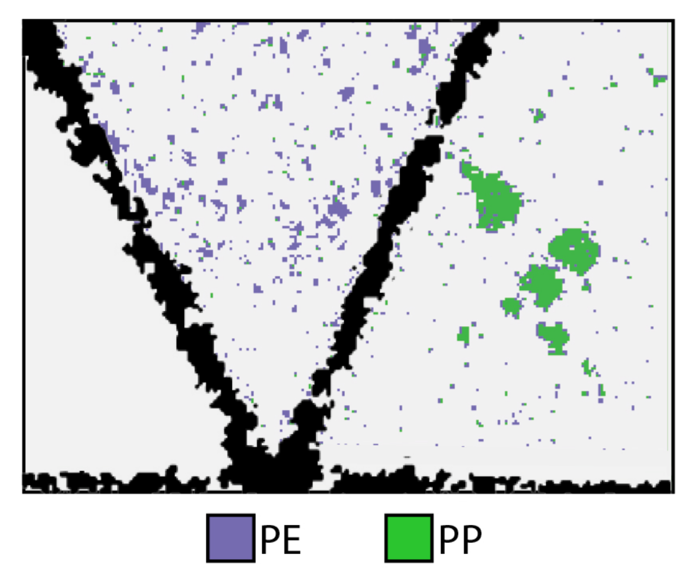

# A Domain-Adaptive Deep Learning Approach for Microplastic Classification

This repository provides supplementary material for the following publication:

**Paper:** [A Domain-Adaptive Deep Learning Approach for Microplastic Classification](https://doi.org/10.3390/microplastics4040069)  
**Authors:** Max Barker, Tanmay Singha, Meg Willans, Mark Hackett, Duc-Son Pham  
**Journal:** Microplastics, 2025, 4(4), 69

The code from the paper compares three domain adaptation methods: DANN, DSAN, and Deep CORAL. Each can be used for classifying marine vs standard polymer spectra using a transformer architecture and reflectance micro-FTIR spectroscopy data. This work extends our earlier transformer for microplastic classification: [Barker et al., AJCAI 2022](https://link.springer.com/chapter/10.1007/978-3-031-22695-3_8) ([code](https://github.com/br3nr/microplastic-transformer)).


## Available in this repository

- Full implementation of the transformer-based classification model with domain adaptation
- Three DA methods: [Deep CORAL](https://arxiv.org/abs/1607.01719), [DSAN](https://arxiv.org/abs/2106.09388), and [DANN](https://arxiv.org/abs/1505.07818)
- CLI for training any method with configurable parameters

If you find this useful, a citation or a star is appreciated.

> **Note:** To address potential CUDA memory constraints in the CORAL and DSAN methods when running this code, a bottleneck layer has been added between the transformer encoder and the domain adaptation loss. This was introduced after publication to simplify execution, and also slightly improves standards accuracy compared to the reported results.

## Setup and Execution

We recommended that the `uv` package manger is used to setup the repo due to its simplicity. 

```bash
# Clone and install
git clone https://github.com/maxbarker/microplastic-da.git
cd microplastic-da
uv sync

# Train with default (tuned) hyperparameters
uv run main.py --method coral
uv run main.py --method dann
uv run main.py --method dsan
```

Note: all dependencies can be found within the `pyproject.toml` should you wish to run your own python environment.

### Data

The data directory (default: `data/`) should contain two CSV files:

- `marine_polymers.csv`: marine polymer FTIR spectra
- `std_polymers.csv`: standard polymer FTIR spectra

Each CSV has a `polymerID` column (PP/PE) followed by wavenumber columns. The marine data is automatically split into train/val/test (70/15/15) with a fixed seed for reproducibility. Standards are used as-is for domain adaptation evaluation.

### W&B logging

Optional [Weights & Biases](https://wandb.ai) integration:

```bash
uv run python main.py --method coral --wandb --wandb-project microplastic-da
```

## Configuring

Each DA method has tuned defaults (see `src/train/trainer.py`). You can override any parameter via CLI flags:

```
--method, -m        DA method: coral, dann, dsan             (default: coral)
--data-dir, -d      Path to data directory                   (default: data)
--epochs, -e        Training epochs                          (default: 10)
--batch-size, -b    Batch size                               (default: 64)
--lr                Learning rate                            (default: 1e-5 / 5e-6 for dsan)
--d-model           Transformer model dimension              (default: 64)
--heads, -H         Attention heads                          (default: 4)
--layers, -N        Transformer encoder layers               (default: 2)
--dropout           Dropout rate                             (default: 0.2)
--pe                Enable positional encoding               (default: off)
--bottleneck-dim    Bottleneck dimension before DA loss      (default: 512)
--diff-order        Savitzky-Golay derivative order          (default: 6)
--diff-interval     Savitzky-Golay derivative interval       (default: 4)
```

## Figures

<p align="center">
  <br>
  <em>Reflectance micro-FTIR spectroscopy workflow: from physical sample to hyperspectral image and extracted spectra.</em>
</p>

<p align="center">
  <br>
  <em>Pixel-level predictions from the transformer model on a micro-FTIR image, showing classified polymer regions.</em>
</p>

## License

[MIT](LICENSE)
